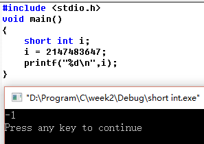

## 思考题答案：

| 类型          | 比特（位）数 | 取值范围                                     |
| ----------- | ------ | ---------------------------------------- |
| int         | 32     | -2147483648~2147483647 即$-2^{31}$~$(2^{31}-1)$ |
| short [int] | 16     | -32768~32767 即$-2^{15}$~$(2^{15}-1)$     |
| long [int]  | 32     | -2147483648~2147483647 即$-2^{31}$~$(2^{31}-1)$ |

注：省略了signed，视编译环境不同而不同，这里是VC

所以可以知道，当把2147483647赋给short int的时候，也就是把32个1赋给short int，只取了（低？）16位。

简化一下举个例子。

| 补(原)码 | 0    | 1    | 1    | 1    | 1    | 1    | 1    | 1    |
| ----- | ---- | ---- | ---- | ---- | ---- | ---- | ---- | ---- |
| 补码    | 舍弃   | 舍弃   | 舍弃   | 舍弃   | 1    | 1    | 1    | 1    |

计算机用的是补码，原码就是二进制形式加上符号位，正数的原码和补码是一样的，负数的话，把原码的符号位不变，其余位取反再加1就得到补码。把8位正数$2^7-1$赋给了4位的，符号位是1，是负数，所以先减1，然后符号位不变，其余按位取反得到原码，即为-1

| 反码   | 1    | 1    | 1    | 0    |
| ---- | ---- | ---- | ---- | ---- |
| 原码   | 1    | 0    | 0    | 1    |

## 上机题答案：

类似的，因为int能表示的最大正数是$2^{31}-1$，也就是2147483647，对应的原码和补码是1个0加31个1，第一个表示符号位，剩余31位表示$2^{31}-1$。如果把2147483648赋给他的话，就是把是1个0,1个1加31个0，赋给他了（因为2147483648是一个1,31个0），只有32位，装不下，最高位的0舍去，于是变成了1个1加31个0，于是就变成了负数，减1再取反可知，变成了-2147483648

我晕了，这最后一句“变成了-2147483648”我也不明白了……回去再想想……

注：markdown语法中添加公式可以参考[这篇教程](http://jzqt.github.io/2015/06/30/Markdown%E4%B8%AD%E5%86%99%E6%95%B0%E5%AD%A6%E5%85%AC%E5%BC%8F/)，在本文中用的不多，就是一个{ }要注意，上标下标多以一个字符要加{ }括起来。